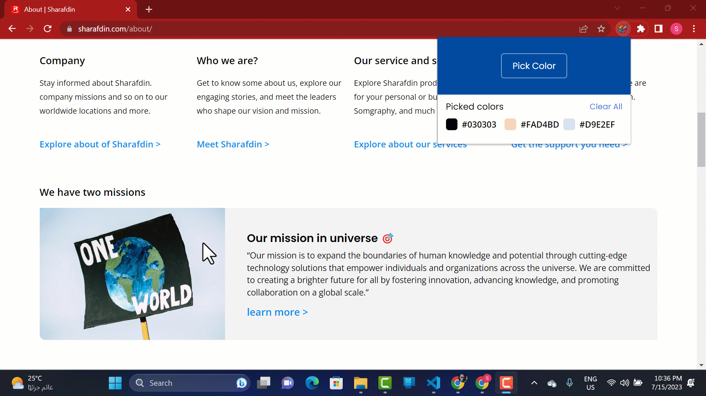

# My Color Picker Extension for Google Chrome

This extension helps you easily select any color of your choice and also stores multiple colors.

## Getting Started

First, to use this extension, make sure you have downloaded and installed Google Chrome on your computer. After that, we will go through the rest step by step.

- [X] Getting Started
- [ ] How to install
- [ ] How to use

## How to install
Since the extension is currently unavailable on Google Chrome, we will need to wait until it becomes available again in order to determine the installation process.
- [x] Getting Started
- [ ] How to install
- [ ] How to use

## How to use:

### Picking Color

### Picking Multiple Colors

### Copying The Colors

### Clearing The Colors

**Note:** The colors are stored in the localStorage, so they will not be lost when the page is refreshed.

- [x] Getting Started
- [ ] How to install
- [x] How to use

### Developers

This extension developed by [Sharafdin](https://www.sharafdin.com)  
[GitHub](https://github.com/sharafdin) |
[Twitter](https://twitter.com/sharafdincorp) |
[LinkedIn](https://www.linkedin.com/company/sharafdin/)
